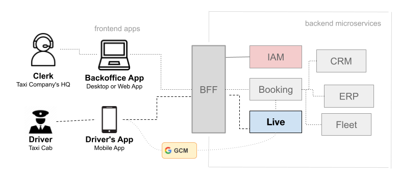
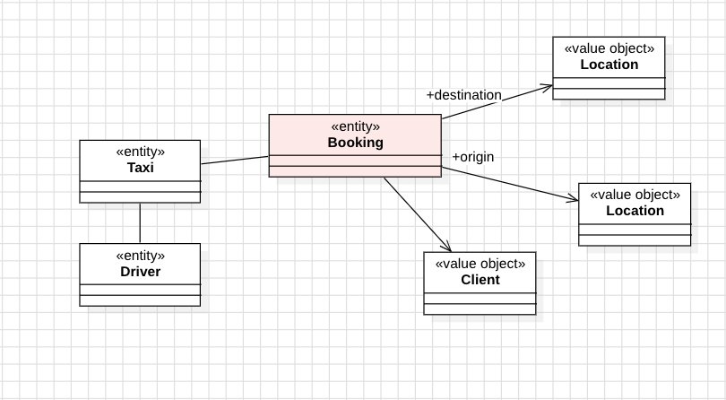
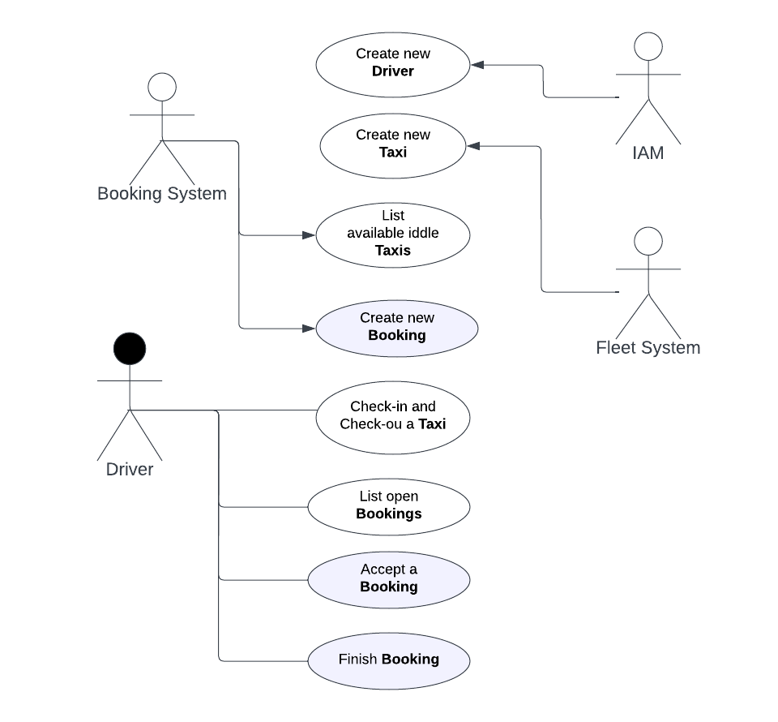
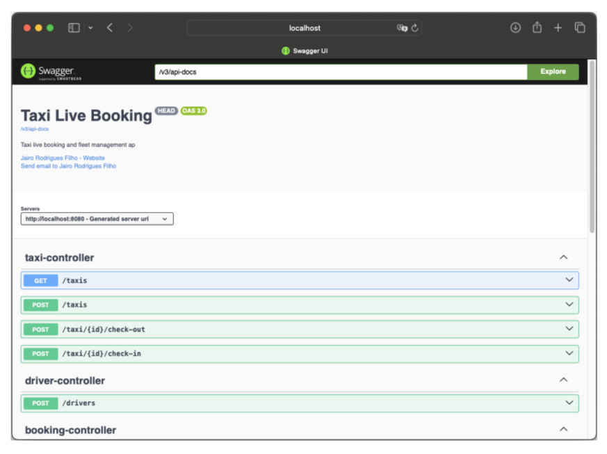

# Taxi Live Booking

This project implements a hypothetical live booking system for a fictional Taxi company.

The idea is that **bookings** are placed in the system and a fleet of **taxis** accept those bookings.

Once the taxi ride is done, the **driver** finishes the **booking** and goes on to the next.

The system also manages the **check-ins** and **check-outs** of the taxi drivers who work in the company.

## What aspect of this exercise did you find most interesting?

The same thing that made this project interesting, made the project cumbersome and difficult.

## What did you find most cumbersome?

The most cumbersome feature of this challenge is the hypothetical nature of the software.

Since the project description presents the challenge in broad strokes only, I had to imagine a fictional taxi company so I could narrow it down to a fictional, but more concrete, microservice of live bookings with real use cases.

Once I had a clear picture of the scope of the software that I should write, then the building processes presented a second challenge: How can I write a fictional but realistic code that was simple enough, so I could write it on time, but complex enough so I could showcase good discipline and craftsmanship to advance to the next phase of the hiring process.

I then had to strive to show in this project my knowledge of how to write software for a modern microservice architecture environment.

## The Solution to The Challenge

A modern taxi company today would have a microservice architecture that I think would look like this:



You would have a front-end application running on the call center in the company's HQ, where the bookings would be created and pushed to the **Boking** service, and then to and **Live** microservice which in turn would be accessed by the drivers on the street using a mobile app.

You would have multiple supporting subsystems such as a **CRM** to track customers' records and interactions, a **Fleet** service where you would manage all the vehicles of the company, a **IAM** to do authentication and authorization of the requests and a **ERP** for invoices, finance and accounting.

All those microservices and subsystems would be accessed by the front-end apps via an internet-facing or VPN-accessible **Backend for Frontend** (**[BFF](https://samnewman.io/patterns/architectural/bff)**) which would take care of authorizing and logging the requests.

The **Live** microservice is the real scope of this project and was what I tried to implement at the best of my abilities and discretion.

### It Should Be Event-Driven

For simplicity's sake, I've devised this project thinking that communications between the services would be done in a synchronized fashion using HTTP requests, but in reality, this project would be best done using messaging.

When a new booking, for instance, is placed in the **Booking** service, I would have this event be published in an **Apache Kafka** topic so the **Live** service would listen and know that a new booking is available and that it should notify the nearby `IDLE` taxis using **Google's GCM** directly or via an another **Kafka**  topic.

### Dashboard and Analytics

This hypothetical architecture probably would have also a bunch of ETL processes mining all those microservice's internal databases for Data Analytics and BI proposes.

> Even though I know that a dashboard was asked in the challenge, the way that I chose to devise the solution made the implementation of a dashboard not feasible, so I took the risk of leaving it out.

## Stack of Choice

This project was done using **Java 17** and **Spring Boot** and **PostgreSQL 16** is the _RDBMS_ of choice.

The code was written using _TDD_ and _DDD_ and the persistence layer of choice was **Spring JDBC**.

### What else is Missing to be a Production Ready Solution?

* Spring Boot **Actuator** should be active so the app can be properly observed and health checked in production.
* End-to-end system testing with rest assured.
* Better use of **OpenAPI**-specific annotations to better document
* High-grade structured logging with **SLF4J**.
* Support to an APM agent like the **NewRelic** one.
* Better global exception handling with proper logging and reporting to an error catcher or APM tool.

## The Domain of The Project

The domain of the project consists of a **Booking** entity that was accepted by a **Driver** of a **Taxi**.



## Use Cases

I envisioned that this **Live** microservice has four major users:

* The **Booking** system that lists available cabs and publishes new bookings to them.
* The **IAM** service which creates the drivers.
* The **Fleet** service that keeps the records of the active taxis.
* The **Driver** that goes to work and makes the runs happen.



## How to Run

The most straightforward way to run this project is via `docker-compose`.

First, run the **PostgreSQL** container in the background:

```bash
docker-compose up db -d
```

Then build and run the app container:

```bash
docker-compose up app --build
```

The app container is built in a multi-staged build. The project is built using a maven image and then the artifact is copied to an Eclipse JRE image which will run it.

### Using Maven

You can also run the application using the Spring Boot command:

```bash
# Create the .env file
cp .env.example .env

# Run it
mvn spring-boot:run
```

### Swagger

Once the app is running, you can check the Swagger API documentation [http://localhost:8080/swagger-ui/index.html](http://localhost:8080/swagger-ui/index.html).



## How to Test

To run the unit tests you can use Maven:

```bash
mvn clean test
```

### Integration Tests

The project also has integration tests that can be run alongside the unit tests:

```bash
mvn clean verify
```

The integration tests are in the `src/integration-test` directory, and they hit a real **PostgreSQL** instance running using [Testcontainers](https://testcontainers.com).
